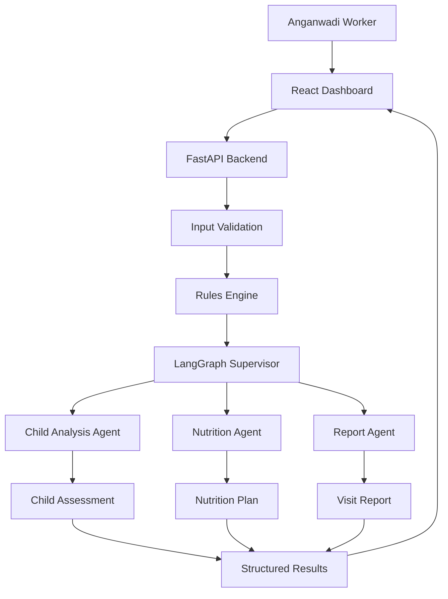

# AnganAI

### Multi-Agent AI Decision-Support System for Anganwadi Workers

AnganAI is an AI-powered decision-support system designed to help Anganwadi workers analyze child growth measurements, assess nutritional risk, generate personalized nutrition recommendations, and prepare structured visit reports.

<p align="left">
  <a href="https://www.python.org/"></a>
  <a href="https://fastapi.tiangolo.com/"></a>
  <a href="https://www.langchain.com/langgraph"></a>
  
  
</p>

---

## Overview

AnganAI is a **dashboard-first Multi-Agent AI application** designed to assist Anganwadi workers in performing child health assessments more efficiently.

The system combines:

- Deterministic input validation
- Rule-based health assessment
- Multi-Agent AI orchestration
- LangGraph workflow management
- Structured LLM outputs
- Personalized nutrition recommendations
- Automated report generation
- Growth visualization
- PostgreSQL persistence
- Docker-based deployment
- Automated CI/CD using GitHub Actions

Rather than functioning as a general-purpose chatbot, AnganAI is designed around a **structured workflow** where each AI agent has a specific responsibility.


---


### Dashboard
AnganAI provides a dashboard-first interface for Anganwadi workers to enter child information, review AI-assisted assessments, generate nutrition recommendations, and prepare structured visit reports.

<br>


---

## Problem Statement

Anganwadi workers regularly collect important child growth measurements such as:

- Age
- Height
- Weight
- MUAC (Mid-Upper Arm Circumference)

These measurements need to be interpreted and converted into useful assessments, nutrition recommendations, and follow-up reports.

This process can involve repetitive manual work and requires information to be interpreted consistently.

AnganAI aims to simplify this workflow by providing an AI-assisted system that:

1. Validates child measurements.
2. Performs deterministic rule-based assessment.
3. Uses specialized AI agents for different tasks.
4. Generates structured recommendations.
5. Produces a structured visit report.
6. Presents the results through a simple dashboard.

---

## Solution

The application follows a **Supervisor-based Multi-Agent architecture**.




---

## Key Features

- **Child Assessment** - Analyzes growth measurements and identifies health risks.
- **AI Nutrition Planning** - Generates personalized, age-appropriate meal recommendations.
- **Automated Reports** - Creates structured visit reports with follow-up guidance.
- **Growth Visualization** - Tracks and visualizes child weight trends.
- **Deterministic Validation** - Validates measurements before they reach the LLM.
- **Multi-Agent Workflow** - LangGraph orchestrates specialized AI agents for assessment, nutrition, and reporting.

## Why Multi-Agent AI?

AnganAI separates the workflow into specialized agents rather than relying on a single monolithic LLM call.

This provides:

- Separation of concerns
- Specialized prompts
- Easier debugging
- More controllable workflows
- Structured outputs
- Clear workflow stages
- Easier future expansion
- Better observability of individual stages

The architecture also allows individual agents to be evaluated or improved independently.

---

## AI Guardrails

AnganAI uses multiple layers of guardrails to make the AI workflow more controlled and predictable.

### 1. Deterministic Input Validation

Child measurements are validated before entering the LLM workflow.

```text
Raw Input
    ↓
Deterministic Validation
    ↓
Rules Engine
    ↓
LLM Workflow
```

Invalid measurements are rejected before AI generation begins.

This ensures that the LLM does not have to determine whether basic input values are valid.

---

### 2. Structured LLM Outputs

Each AI agent uses a dedicated Pydantic schema to constrain its response.

Instead of relying on unpredictable free-form text, downstream workflow stages receive structured data.

This improves:

- Output consistency
- Data validation
- Frontend integration
- Error handling
- Workflow reliability

---

## Deployment Architecture

AnganAI was containerized and deployed to AWS as part of the project's MLOps implementation.

```text
                     GitHub Repository
                            │
                            ▼
                   GitHub Actions CI/CD
                            │
             ┌──────────────┴──────────────┐
             │                             │
       Backend Checks               Frontend Build
             │                             │
             └──────────────┬──────────────┘
                            ▼
                     Docker Build
                            │
                            ▼
                       Amazon ECR
                            │
                            ▼
                         AWS EC2
                            │
                     Docker Compose
                            │
             ┌──────────────┴──────────────┐
             │                             │
       FastAPI Backend                PostgreSQL
             │
             ▼
       LangGraph Workflow
```

## MLOps & CI/CD

AnganAI includes an automated CI/CD pipeline covering backend validation, frontend builds, Docker image creation, container registry publishing, and EC2 deployment.

## CI/CD Pipeline

```text
Git Push
   ↓
GitHub Actions
   ↓
Backend Checks
   ├── Python dependency installation
   └── Python compilation checks
   ↓
Frontend Checks
   ├── npm ci
   └── Production build
   ↓
Docker Image Build
   ↓
Amazon ECR
   ↓
EC2 Deployment
   ↓
Docker Compose
   ↓
Health Check
```

---

## Deployment Metrics

The deployed application was validated on an AWS EC2 instance.

| Metric | Result |
|---|---:|
| CI/CD pipeline execution | ~1m 51s |
| Health endpoint response time | ~1.9–2.1 ms |
| Backend memory usage | ~84 MB |
| PostgreSQL memory usage | ~36 MB |
| Backend Docker image content size | ~95.6 MB |


---

## Tech Stack

| Layer | Technologies |
|---|---|
| **Backend** | Python, FastAPI, LangChain, LangGraph, Pydantic |
| **AI / ML** | Groq LLM API, Llama models, structured LLM outputs, rule-based validation, prompt engineering |
| **Data** | PostgreSQL |
| **Infrastructure / MLOps** | Docker, Docker Compose, GitHub Actions, Amazon ECR, AWS EC2, Self-hosted GitHub Actions Runner |
| **Version Control** | Git, GitHub |

---


## Key Engineering Decisions

### Deterministic logic before LLM reasoning

Input validation and rule-based checks are performed before the AI workflow. This prevents basic invalid inputs from being passed directly to the LLM.


### Specialized AI agents

Each agent has a focused responsibility rather than relying on one large prompt.


### Structured outputs

Pydantic schemas constrain the outputs of individual agents. This allows the frontend and downstream workflow stages to work with predictable data structures.


### Containerized deployment

The backend is packaged as a Docker image, creating a reproducible deployment environment across local development and cloud infrastructure.

### Automated CI/CD

GitHub Actions validates the application, builds the Docker image, pushes it to Amazon ECR, and deploys the containerized backend to EC2.


## Getting Started

### Prerequisites

- Python 3.12+
- Node.js 18+
- Git
- Docker Desktop
- A [Groq API key](https://console.groq.com/)

---

### 1. Clone the Repository

```bash
git clone https://github.com/<your-username>/AnganAI.git
cd AnganAI
```

---

### 2. Backend Setup

Create and activate a virtual environment:

### Windows

```bash
python -m venv .venv
.venv\Scripts\activate
```

### macOS / Linux

```bash
python -m venv .venv
source .venv/bin/activate
```

Install dependencies:

```bash
pip install -r requirements.txt
```

Create:

```text
backend/.env
```

Add:

```env
GROQ_API_KEY=your_groq_api_key
MODEL_NAME=llama-3.3-70b-versatile

DATABASE_URL=your_database_url
```

Start the backend:

```bash
python -m uvicorn backend.main:app --reload --host 127.0.0.1 --port 8000
```

Backend:

```text
http://127.0.0.1:8000
```

Interactive API documentation:

```text
http://127.0.0.1:8000/docs
```

---

### 3. Frontend Setup

```bash
cd frontend
npm install
```

Create:

```text
frontend/.env
```

Add:

```env
VITE_API_URL=http://127.0.0.1:8000
```

Start the frontend:

```bash
npm run dev
```

The application will be available at the local URL provided by Vite.

---

### 4. Docker Setup

The backend and PostgreSQL database can be run using Docker Compose.

```bash
docker compose up --build
```

The backend will be available at:

```text
http://localhost:8000
```

API documentation:

```text
http://localhost:8000/docs
```

To stop the containers:

```bash
docker compose down
```

---

## API

### `POST /analyze`

Runs a child's information through the complete LangGraph workflow.

### Request

```json
{
  "name": "Rahul",
  "age": 2,
  "gender": "Male",
  "height": 82,
  "weight": 9,
  "muac": 13.5
}
```

### Response

```json
{
  "child_data": {
    "name": "Rahul",
    "age": 2,
    "gender": "Male",
    "height": 82,
    "weight": 9,
    "muac": 13.5
  },
  "assessment": {
    "growth_status": "Underweight",
    "risk_level": "Moderate",
    "summary": "...",
    "recommendation": "...",
    "follow_up_days": 14
  },
  "nutrition": {
    "breakfast": "...",
    "lunch": "...",
    "evening_snack": "...",
    "dinner": "...",
    "supplement": "..."
  },
  "report": {
    "summary": "...",
    "parent_advice": "...",
    "worker_notes": "..."
  }
}
```

---

## Validation & Error Handling

Measurements are checked against expected physiological ranges before the AI workflow is invoked.

```text
Age     → 0–5 years
Height  → 30–130 cm
Weight  → 1–40 kg
MUAC    → 5–30 cm
```

Requests outside these ranges are rejected with a structured error rather than being passed to the AI agents.

Example:

```json
{
  "detail": {
    "message": "Invalid child measurements.",
    "errors": [
      "Age must be between 0 and 5 years.",
      "Height must be between 30 and 130 cm.",
      "Weight must be between 1 and 40 kg."
    ]
  }
}
```

This separation between deterministic validation and LLM processing improves reliability and makes the system easier to debug.

---

## Future Improvements

The next stage of the project focuses on **AI observability, evaluation, and product expansion**.

- [ ] LangSmith-based agent tracing and observability
- [ ] Ragas-based LLM evaluation
- [ ] Agent latency and token usage monitoring
- [ ] Automated evaluation dataset
- [ ] Improved growth reference visualization
- [ ] Assessment history and multiple-child profiles
- [ ] Offline-first support for low-connectivity environments


# Author

Made with ❤️ by Vidhi - [GitHub](https://github.com/Vidhisahay) · [LinkedIn](https://www.linkedin.com/in/vidhisahay/)