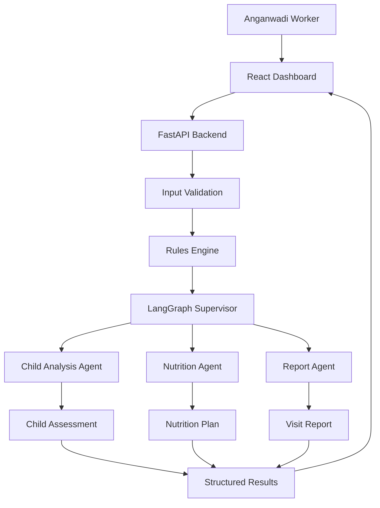

# AnganAI

### Multi-Agent AI Assistant for Anganwadi Workers

An AI-powered decision-support system that helps Anganwadi workers analyze child growth measurements, assess nutritional risk, generate personalized nutrition recommendations, and prepare structured visit reports.

<p align="left">
  <a href="https://www.python.org/"></a>
  <a href="https://fastapi.tiangolo.com/"></a>
  <a href="https://www.langchain.com/langgraph"></a>
  <a href="https://react.dev/"></a>
  <a href="https://www.typescriptlang.org/"></a>
  
  
</p>

## Overview

AnganAI is a **dashboard-first Multi-Agent AI application** designed to assist Anganwadi workers in performing child health assessments more efficiently.

The system combines:

- Deterministic input validation
- Rule-based health assessment
- Multi-Agent AI orchestration
- LangGraph
- Structured LLM outputs
- Nutrition recommendations
- Automated report generation
- A React-based dashboard

Rather than functioning as a general-purpose chatbot, AnganAI is designed around a **structured workflow** where each AI agent has a specific responsibility.

---

## Problem Statement

Anganwadi workers regularly collect important child growth measurements such as:

- Age
- Height
- Weight
- MUAC (Mid-Upper Arm Circumference)

These measurements need to be interpreted and converted into useful assessments, nutrition recommendations, and follow-up reports.

This process can involve repetitive manual work and requires information to be interpreted consistently.

AnganAI aims to simplify this workflow by providing an AI-assisted system that:

1. Validates child measurements.
2. Performs deterministic rule-based assessment.
3. Uses specialized AI agents for different tasks.
4. Generates structured recommendations.
5. Presents the results through a simple dashboard.

---

# Solution

The application follows a **Supervisor-based Multi-Agent architecture**.




## Key Features

### Child Health Assessment
Workers enter a child's age, height, weight, and MUAC. The system returns growth status, risk level, measurement interpretation, and relevant health observations.

### AI Nutrition Planning
The Nutrition Agent generates a structured meal plan (breakfast, lunch, evening snack, dinner, and a supplement reminder), personalized by age, growth assessment, risk level, MUAC category, dietary preferences, affordability, and locally available foods.

### Automated Visit Reports
The Report Agent combines child information, measurements, growth assessment, risk indicators, nutrition recommendations, and follow-up guidance into a structured, PDF-ready visit report.

### Growth Visualization
The dashboard includes a growth chart to help workers track weight trends over time.

### Deterministic Validation
Raw input is never sent straight to an LLM. Measurements are checked against expected physiological ranges first, so obviously invalid values are rejected before the AI workflow starts.

### Multi-Agent AI Workflow
LangGraph coordinates specialized agents instead of relying on a single, monolithic LLM call, making the system easier to reason about, debug, and extend.

---


## Why Multi-Agent AI?

Instead of asking a single LLM to perform the entire task, AnganAI separates responsibilities into specialized agents. This provides:

- Separation of concerns
- Easier debugging
- More controllable workflows
- Specialized prompts per task
- Structured, predictable outputs
- Easier future expansion
- Better observability of individual workflow stages

```text
Child Analysis
      ↓
Risk Assessment
      ↓
Nutrition Recommendation
      ↓
Visit Report
```

Each stage has a clearly defined responsibility.


---

## Tech Stack

| Layer | Technologies |
|---|---|
| **Frontend** | React (Vite), TypeScript, Tailwind CSS, shadcn/ui, Recharts, Axios |
| **Backend** | Python, FastAPI, LangGraph, LangChain, Pydantic |
| **Data** | PostgreSQL (persistence), Redis (caching) |
| **AI / ML** | Groq LLM API, Llama models, structured LLM outputs, rule-based validation, prompt engineering |
| **Infrastructure** | Docker, Git, GitHub |

> PostgreSQL and Redis support the persistence and caching layer as the project moves beyond the MVP.

---


## Getting Started

### Prerequisites

- Python 3.11+
- Node.js 18+
- Git
- A [Groq API key](https://console.groq.com/)
- PostgreSQL and Redis

### 1. Clone the Repository

```bash
git clone https://github.com/<your-username>/AnganAI.git
cd AnganAI
```

### 2. Backend Setup

Create and activate a virtual environment:

```bash
python -m venv .venv

# Windows
.venv\Scripts\activate

# macOS / Linux
source .venv/bin/activate
```

Install dependencies:

```bash
pip install -r backend/requirements.txt
```

Create `backend/.env`:

```env
GROQ_API_KEY=your_groq_api_key
MODEL_NAME=llama-3.3-70b-versatile

# Optional — only needed if persistence/caching is enabled
DATABASE_URL=your_database_url
REDIS_URL=your_redis_url
```

Start the backend from the project root:

```bash
python -m uvicorn backend.main:app --reload --host 127.0.0.1 --port 8000
```

- API: `http://127.0.0.1:8000`
- Interactive docs: `http://127.0.0.1:8000/docs`

### 3. Frontend Setup

```bash
cd frontend
npm install
```

Create `frontend/.env`:

```env
VITE_API_URL=http://127.0.0.1:8000
```

Start the frontend:

```bash
npm run dev
```

The app will be available at the local URL printed by the dev server.

---

## API

### `POST /analyze`

Runs a child's information through the complete LangGraph workflow.

**Request**
```json
{
  "name": "Rahul",
  "age": 2,
  "gender": "Male",
  "height": 82,
  "weight": 9,
  "muac": 13.5
}
```

**Response**
```json
{
  "child_data": {
    "name": "Rahul",
    "age": 2,
    "gender": "Male",
    "height": 82,
    "weight": 9,
    "muac": 13.5
  },
  "assessment": {
    "growth_status": "Underweight",
    "risk_level": "Moderate",
    "summary": "...",
    "recommendation": "...",
    "follow_up_days": 14
  },
  "nutrition": {
    "breakfast": "...",
    "lunch": "...",
    "evening_snack": "...",
    "dinner": "...",
    "supplement": "..."
  },
  "report": {
    "summary": "...",
    "parent_advice": "...",
    "worker_notes": "..."
  }
}
```

---

## Validation & Error Handling

Measurements are checked against expected physiological ranges before the AI workflow is invoked:

```text
Age     → 0–5 years
Height  → 30–130 cm
Weight  → 1–40 kg
MUAC    → 5–30 cm
```

Requests outside these ranges are rejected with a structured error rather than being passed to the AI agents:

```json
{
  "detail": {
    "message": "Invalid child measurements.",
    "errors": [
      "Age must be between 0 and 5 years.",
      "Height must be between 30 and 130 cm.",
      "Weight must be between 1 and 40 kg."
    ]
  }
}
```

This separation between deterministic validation and LLM processing improves reliability and makes the system easier to debug.

---


## Future Improvements

- [ ] Improved growth reference visualization
- [ ] Assessment history and multiple-child profiles
- [ ] PostgreSQL persistence
- [ ] Hindi and regional language support
- [ ] Voice-based data entry
- [ ] Notifications and follow-up reminders
- [ ] Offline-first support for low-connectivity environments
- [ ] Agent workflow observability and monitoring

---

# Author

Made with ❤️ by Vidhi - [GitHub](https://github.com/Vidhisahay) · [LinkedIn](https://www.linkedin.com/in/vidhisahay/)